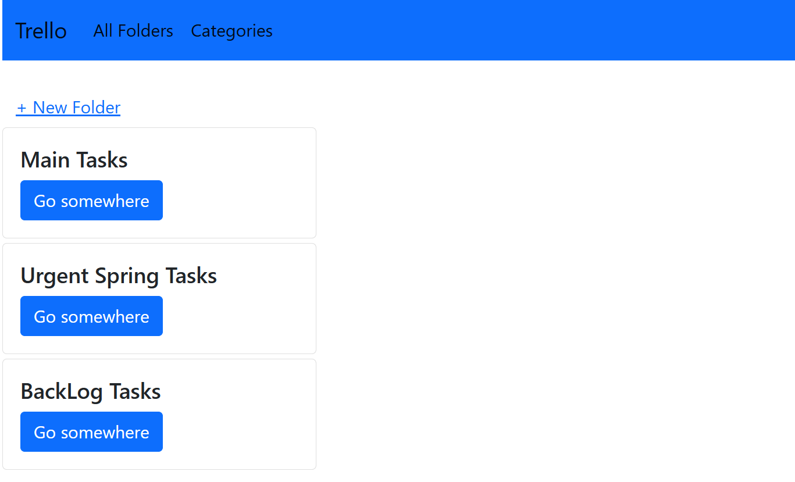
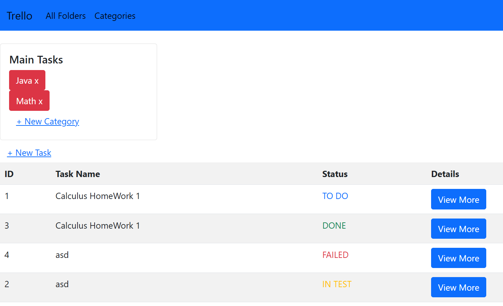
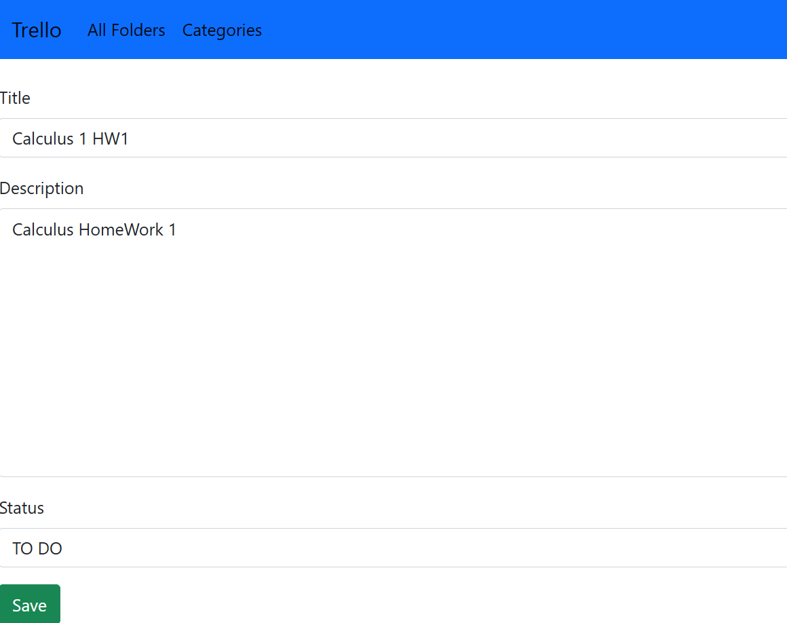

# Trello Clone - Spring Boot Project

**Description:**  
This is a simplified task management system inspired by Trello.  
It allows users to create folders, add categories, manage tasks, change task statuses, and add comments.  
The application is built using Spring Boot and PostgreSQL, making it a full-stack backend project suitable for learning and showcasing Java development skills.

---

## Features

- **Category Management:** Create, update, and delete task categories.
- **Folder Management:** Create, update, and delete folders.
- **Task Management:** Create, update, and delete tasks (tasks must belong to a folder).
- **Task Status:**
    - `0` - TODO
    - `1` - IN TEST
    - `2` - DONE 
    - `3` - FAILED 
- **Comments:** Add and view comments on tasks.
- **Rules:** Tasks with status DONE or FAILED are closed and cannot be edited or commented on.

---

## Technologies Used

- Java 25
- Spring Boot
- Spring Data JPA (Hibernate)
- PostgreSQL
- Lombok
- Thymeleaf - layout dialect

---
## Main Page

## Task Details Page 

# ⚠️ FRONTEND

**⚡ NOTE:** The frontend was **copied/used from a template** and integrated with the backend.  